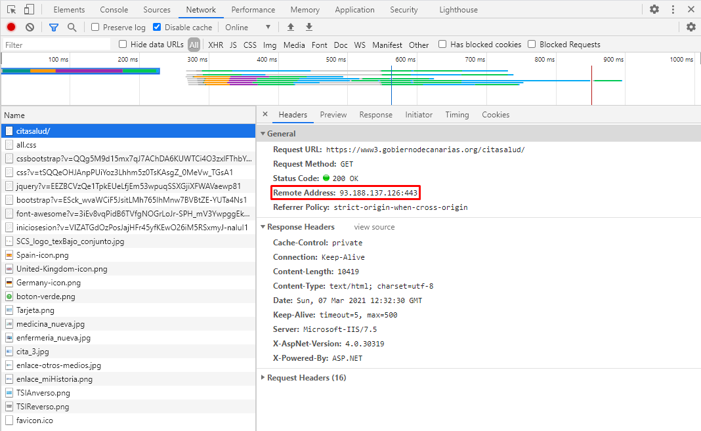

# Uso del navegador para el desarrollo web

## 1. Introducción

Esta práctica consiste en buscar información en la página web [miCita previa](https://www3.gobiernodecanarias.org/citasalud/) del Servicio Canario de Salud con el objetivo de estudiar el uso del navegador para el desarrollo web, en concreto se utilizarán los navegadores **Chrome** y **Firefox**. Para responder a las diferentes cuestiones se incluye una imagen donde se indica en un **rectángulo rojo** la respuesta.

## 2. Cuestiones

* ### ¿Qué peticiones desencadena la consulta?

Las peticiones que provoca la consulta a la página web son las que se encuentran en la tabla de solicitudes del panel `Network (Chrome)` o `Red (Firefox)` los cuales enumeran todos los recursos recuperados. A continuación, se muestran las imágenes de las peticiones:

**Chrome:**

**Firefox:**

Cabe destacar que la petición principal es `citasalud/` la cual provoca que se desencadenen el resto de las peticiones.

Como se puede observar en las imágenes anteriores los `paneles Network (Chrome)` y `Red (Firefox)` registran información sobre cada operación de red en una página, incluidos datos de tiempo detallados, encabezados de solicitud y respuesta HTTP, cookies y más.

* ### ¿Qué tipo de petición estás realizando?

La petición realizada es de **tipo GET**, por tanto, esta petición sólo debe recuperar datos.

**Chrome:**

**Firefox:**

Para saber el tipo de petición, hemos seleccionado el recurso `citasalud/` y hemos accedido a la `pestaña Headers` en Chrome y Cabeceras en Firefox. En cada una de estas pestañas se muestra más información relevante, por ejemplo, el **código de estado de respuesta** y la **IP del servidor**.

* ### Qué código de estatus devuelve.

El código de estatus es el **200 OK** por lo que la petición ha tenido éxito y el recuso ha sido recuperado correctamente.

**Chrome:**

**Firefox:**

* ### ¿Qué DNS tiene el servidor?

El **sistema de nombres de dominio (DNS)** es un sistema de nomenclatura estándar que asigna un nombre lógico a una dirección IP. En este caso el DNS del servidor es www3.gobiernodecanarias.org.

**Chrome:**

**Firefox:**

* ### ¿Qué IP tiene tiene el servidor?

La IP del servidor es `93.188.137.126:443`.

**Chrome:**

**Firefox:**

* ### ¿La página tiene alguna cookie?, ¿Cuáles?

La página sí tiene cookies y son las que se muestran en las siguientes imágenes:

**Chrome:**

**Firefox:**

* ### ¿Qué idioma acepta?

En `Accept-Language` dentro de la cabecera de petición se indican los idiomas que puede comprender el cliente y qué variante de configuración regional se prefiere.

**Chrome:**

**Firefox:**

* ### Alguna línea de código JavaScript.

Para obtener los recursos escritos en JavaScript hemos seleccionado en los filtros la opción `JS` y hemos elegido uno de los que aparecían. Un ejemplo de línea de código JavaScript es la que se muestra a continuación:

**Chrome:**

**Firefox:**

* ### Alguna línea de código CSS que se aplique.

En este caso en los filtros hemos seleccionado la opción CSS, dentro del recurso hemos elegido como ejemplo el siguiente fragmento de código.

**Chrome:**

**Firefox:**

* ### Alguna línea de código HTML que se aplique.

Para conseguir alguna línea de código HTML hemos seleccionado el recurso citasalud y accedido a la pestaña Response en Chrome y a Respuesta en Firefox, la línea que hemos elegido es la que se muestra a continuación:

**Chrome:**

**Firefox:**

## 3. Conclusión

Esta práctica nos ha permitido conocer el conjunto de herramientas de desarrollo web que están integradas directamente en los navegadores Chrome y Firefox. Además, con las diferentes cuestiones planteadas, hemos aprendido como utilizar estas herramientas para buscar información relevante a la hora de crear sitios web y, hemos podido ver la manera en la que se aplican los conceptos enseñados en la “Introducción a la Web” en el propio navegador. Por todo esto, consideramos que la práctica es muy interesante porque muestra el manejo de los navegadores desde el punto de vista del desarrollo web.

